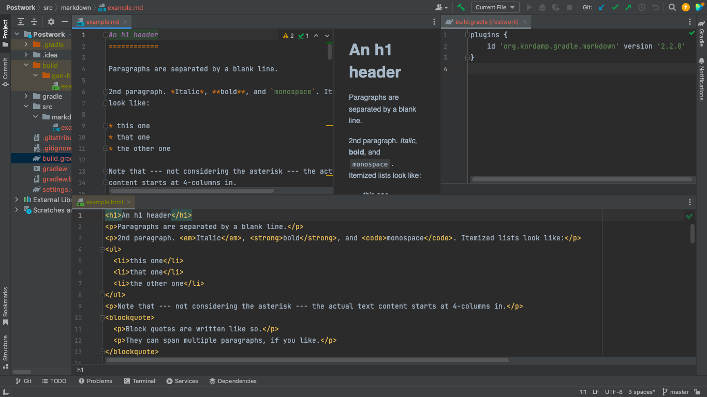

Postwork 1 
Crear un archivo HTML a partir de un Markdown. 

// Se crea el directorio donde se almacenara el archivo Mark down: src/Markdown

// El archivo se creo a partir de la siguiente plantilla:
        

// Se genera un archivo de tipo .md donde se coloca el la informacion del Markdown.

// se hace la creacion de los plugins [build.gradle](build.gradle)

// Finalmente el codigo se corre en una terminal local bajo los comandos: 
        - gradle task
        - gradle markdownToHtml

// resultado:
 

