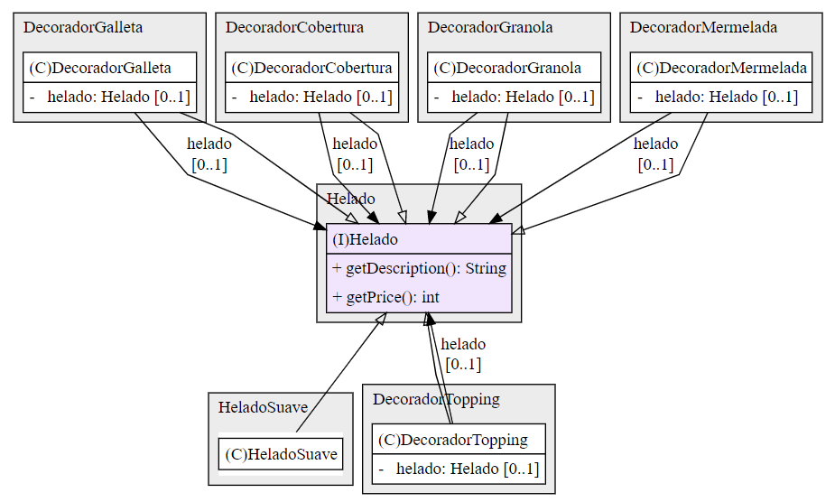

# POSTWORK 2
## PATRONES DE DISEÑO
### Objetivo
* Resolver un problema utilizando patrones de diseño
* Construir la solución utilizando Gradle
### Instrucciones
Una cadena de helados muy famosa en el país ha solicitado tu ayuda para implementar una nueva versión de su sistema actual. Sus productos disponibles son los siguientes:

* Helado Suave $30
* Con Cobertura $20 extra
* Con Granola $10 extra
* Con Topping $20 extra

El sistema actualmente está diseñado con Programación Orientada a Objetos usando el lenguaje Java y tienen una clase por cada variante de los productos, como se muestra a continuación:
```
class HeladoSuave {
  //...
}

class HeladoSuaveConCobertura {
  // ...
}

class HeladoSuaveConGranola {
  // ...
}

class HeladoSuaveConTopping {
  // ...
}

class HeladoSuaveConCoberturaYToping {
  // ...
}

class HeladoSuaveConToppingYGranola {
  // ...
}

class HeladoSuaveConCoberturaYGranola {
  // ...
}
```
La cadena busca agregar nuevos extras:

* Con Mermelada $10 extra
* Con Galleta $15 extra

La inclusión de estos productos complica el desarrollo del sistema actual debido a que habría que agregar todas las variantes de los productos viejos con los nuevos. Por lo tanto el sistema no es mantenible.

Tú misión será crear la nueva versión del sistema utilizando el patrón Decorador de los patrones estructurales, así como un programa que permita probar la nueva implementación.

### Desarrollo
#### 1. Diseño de aplicación y clases
1. Aplicación con clase main: 
   * Crea el objeto Helado que tiene la implementación del patrón decorador.
   * Llama a los métodos getDescription y getPrice para mostrar las características del helado.
   * Crea los objetos decoradores para agregar características al helado inicial.
   * Llama a los métodos getDescription y getPrice para mostrar las características añadidas al helado.
2. Patrón decorador:
   * Interfaz Helado indicando la implementación de los métodos getDescription y getPrice.
   * Clase HeladoSuave que implementa los métodos base de getDescription y getPrice.
   * DecoradorCobertura, DecoradorGalleta, DecoradorGranola, DecoradorMermelada y DecoradorTopping: Clases que implementan la interfaz Helado y contienen un objeto helado sobre el que 'añaden comportamiento'
   

#### 2. Implementación de clases
##### 2.1 [Interfaz Helado](src/main/java/Helado.java)

##### 2.2 Clase HeladoSuave
```
..
```
##### 2.3 Clase DecoradorCobertura
```
..
```
##### 2.4 Clases DecoradorGranola, DecoradorTopping, DecoradorMermelada y DecoradorGalleta
```
..
```
##### 2.5 Clase Aplicacion
```
..
```

#### 3. Resultado
Ejecución de la aplicación
```
....
```
La clase inicial ...
