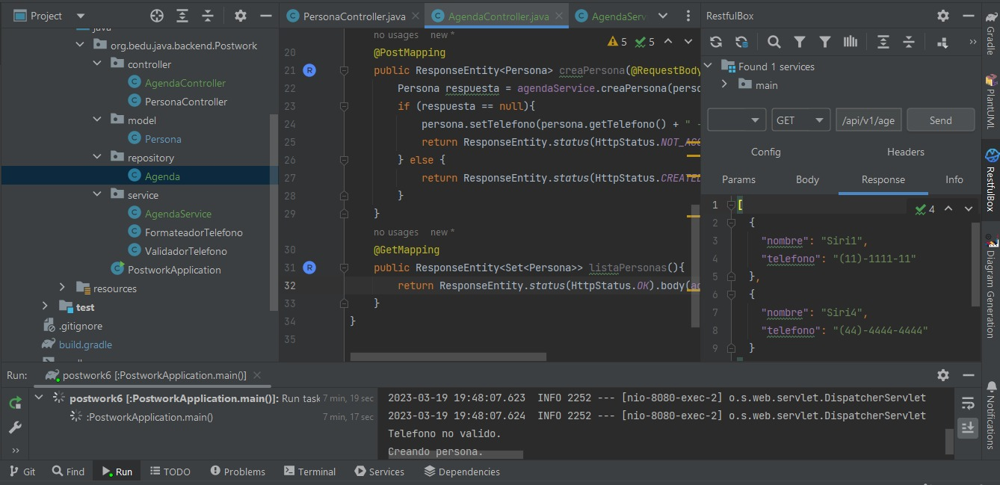
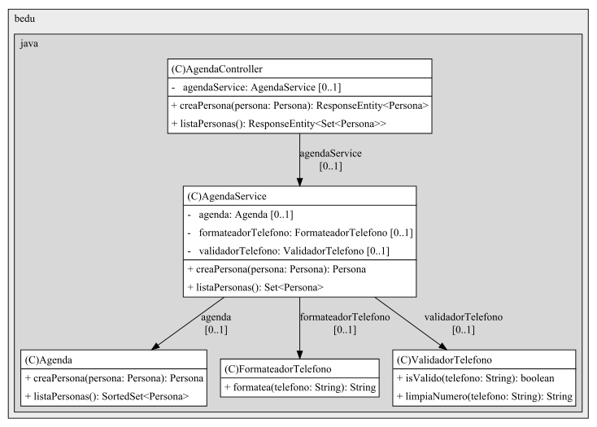

## Postwork Sesión 6: Patrón MVC con Spring Boot

## OBJETIVO
- Eliminar el uso de la línea de comandos y desarrollar una API Rest que reciba nombre y número de teléfono de la agenda.
- Realizar el proceso de validación y limpieza del teléfono.
- Almacear la información en memoria usando un Set de Java que ordene los nombres de forma alfabética.
- Regresar la información en formato JSON.
- Implementar el patrón MVC.
- La clase servicio debe contener la lógica de la aplicación y recibir todas sus dependencias a través de inyección por constructor.

## DESARROLLO
1. Se crearon los paquetes controller, model, repository y service.
2. En la clase persona se implementó la interface java.lang.Comparable usando los nombres, y se implementó el método _compareTo()_ para su acomodo de forma alfabética.
3. En el paquete repository se creó la clase _Agenda_ decorada con la anotación **@Repository** para ser tratada como Bean.
4. En la clase _Agenda_ se implementó la interfaz _SortedSet_ con la implementación TreeSet, utilizando un "árbol" para almacenar los elementos (Personas) en orden.
5. Se agregaron dos métodos: uno que crea objetos Persona y los guarda, y otro que los regresa en una lista.
6. En el paquete _Service_ se creó la clase _AgendaService_ decorada con la anotación **@Service**.
8. Con la anotación **@Autowired** se inyectaron las instancias de las clases: Agenda, ValidadorTelefono y FormateadorTelefono.
9. Se agregó un método con la condición _if_ para validar el teléfono, formatearlo y crear la instancia de "Persona".
10. En un segundo método se utilizó la instancia de _Agenda_ para regresar la lista de Personas.
11. En el paquete controller se creó la clase _AgendaController_ decorada con las anotaciones **@RestController** (servicio web RESTful) y **@RequestMapping** (mapear URL).
12. Con la anotación **@Autowired** se inyectó la instancia _AgendaService_.
13. Con el método **@PostMapping** se recibe un objeto de tipo Persona en una petición HTTP POST. Regresa un mensaje de error si recibe un valor null.
14. Con el método **@GetMapping** se obtiene la lista de personas en la agenda.
15. En el paquete controller se creó la clase _PersonaController_ decorada con las anotaciones **@RestController** y **@RequestMapping**.
16. El método _creaPersona()_ se ejecuta cuando recibe una solicitud en la URL, y asigna los datos recibidos en **@RequestBody**. Asimismo; valida, formatea y crea una instancia de "Persona".
17. Si hay un error, se imprime el mensaje de _teléfono no valido_.

## EVIDENCIA

---
Estructura de clase AgendaController

